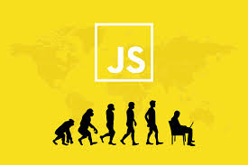

# kottans-frontend - Hello, World of Kottans!

I want to learn Front-End better and deeper with your help! Let's go ^-^ party :)))!!!

---

### Self-learning

---

### - [X] _0. Git intro_ - I knew a lot of new interesting things about Git. I learned branch, fetch, rebase, cherry-pick, log, HEAD and many other thing.

- [x] 0.1 _[Version Control with Git]_ - https://classroom.udacity.com/courses/ud123

 [Git Udacity](https://github.com/TatyanaMolchanova/kottans-frontend/blob/main/images/git0-1.jpg)

- [x] 0.2 _[Main: Introduction Sequence; Remote: Push & Pull -- Git Remotes]_ - https://learngitbranching.js.org/

[learngitbranching main](https://github.com/TatyanaMolchanova/kottans-frontend/blob/main/images/git1.jpg)
       
[learngitbranching remote](https://github.com/TatyanaMolchanova/kottans-frontend/blob/main/images/git2.jpg)

## Linux CLI, and HTTP

- [x] 0.2 _[Linux Survival (4 modules)]_ - https://linuxsurvival.com/linux-tutorial-introduction/
      
       
      [test1](https://github.com/TatyanaMolchanova/kottans-frontend/blob/main/images/linux33.jpg)
      [test2](https://github.com/TatyanaMolchanova/kottans-frontend/blob/main/images/linux44.jpg)
      [test3](https://github.com/TatyanaMolchanova/kottans-frontend/blob/main/images/linux22.jpg)
      [test4](https://github.com/TatyanaMolchanova/kottans-frontend/blob/main/images/linux11.jpg)

I knew many commands in Linux shell. Before this I knew just ls, cd and kill PID. Also I read articles and knew many new info about HTTP.

## Git Collaboration

 [Udacity](https://github.com/TatyanaMolchanova/kottans-frontend/blob/main/task_git_collaboration/git.png)
       
[Git main learngitbranching.js.org](https://github.com/TatyanaMolchanova/kottans-frontend/blob/main/task_git_collaboration/git1.jpg)
       
[Git remote learngitbranching.js.org](https://github.com/TatyanaMolchanova/kottans-frontend/blob/main/task_git_collaboration/git2.jpg)

I was impressed by Udacity course, especially by git rename, git rebase, pull requests.

## Intro to HTML and CSS

 [Udacity](https://github.com/TatyanaMolchanova/kottans-frontend/blob/main/task_html_css_intro/html-css2.png)
       
[Codecademy](https://github.com/TatyanaMolchanova/kottans-frontend/blob/main/task_html_css_intro/css3.png)

I knew this themes (HTML5, CSS3), just repeated them.