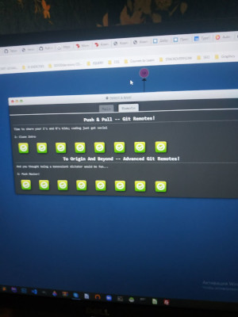
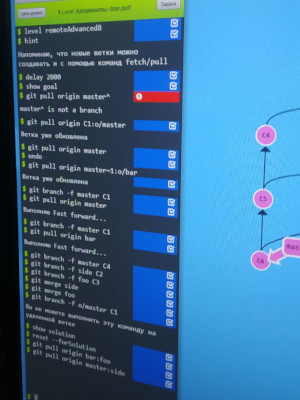

# kottans-frontend - Hello, World of Kottans!
I want to learn Front-End better and deeper with your help! Let's go ^-^ party :)))!!!

_ _ _

### Self-learning

---

- [X] *0. Git intro*
   - [X] 0.1 _[Version Control with Git]_ - https://classroom.udacity.com/courses/ud123
   
   
   
   - [X] 0.2 _[Main: Introduction Sequence; Remote: Push & Pull -- Git Remotes]_ - https://learngitbranching.js.org/
   
   
   
   
   
   
